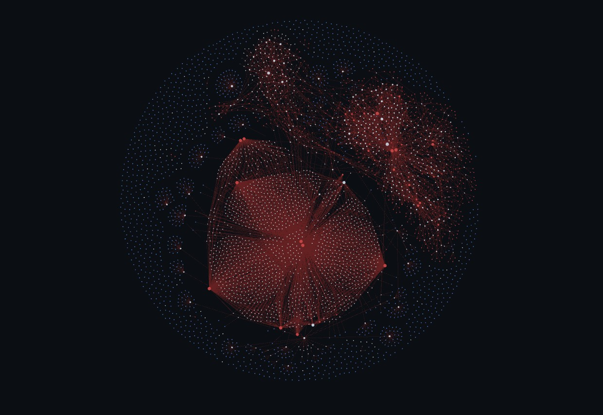
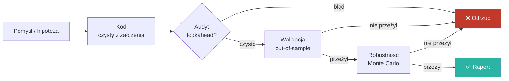

# Maciej Ageev — AI Tools Specialist

**Buduję działające systemy AI na potrzeby rynków finansowych** — lokalne modele LLM,
wyszukiwanie semantyczne (RAG), automatyzacja i orkiestracja asystentów AI w realnym,
wieloskładnikowym projekcie badawczym.

📍 Serock · ✉ ageevmaciek@gmail.com · 📞 790 778 332

&nbsp;

---

## 👤 Kim jestem

Nie tylko *używam* modeli językowych — **buduję wokół nich działające systemy**.
Samodzielnie postawiłem i utrzymuję prywatny projekt badawczy do analizy rynków finansowych,
w którym łączę: lokalnie hostowane modele LLM, własny system RAG offline, pamięć między
sesjami i zautomatyzowane pipeline'y z bramkami jakości.

Wykształcenie techniczne (technik mechatronik) daje mi inżynierską dyscyplinę:
**weryfikuję wyniki zamiast im ufać** i myślę w kategoriach „gdzie to się może zepsuć".

> ⚠️ Główny projekt jest **prywatny** (autorskie badania). To repozytorium to sanityzowany
> przegląd architektury, metody pracy i kompetencji — bez wrażliwych szczegółów strategii.

---

## 🗂️ Co znajdziesz w tym repo

| Plik | Co to jest |
|---|---|
| 📄 **[CV-Maciej-Ageev.pdf](CV-Maciej-Ageev.pdf)** | Jednostronicowe CV (gotowe do druku, tekst selektowalny) |
| ⚙️ **[docs/workflow.md](docs/workflow.md)** | Jak pracuję — bramkowany pipeline badawczy (diagram) |
| 🧠 **[docs/ai-stack.md](docs/ai-stack.md)** | Architektura lokalnego stacku AI: LLM + RAG + MCP + pamięć |
| 🔭 **[docs/about-project.md](docs/about-project.md)** | O projekcie badawczym (sanityzowany przegląd) |
| 🕸️ **[assets/graph-overview.jpg](assets/graph-overview.jpg)** | Graf wiedzy całego projektu (Obsidian) |

---

## 🕸️ Mój projekt jako graf wiedzy

Cały projekt prowadzę jako połączoną bazę wiedzy w Obsidian. Graf pokazuje skalę i strukturę
powiązań notatek badawczych, decyzji i komponentów systemu:

Każdy węzeł to notatka (strategia, audyt, decyzja, komponent infrastruktury AI),
krawędzie to powiązania. Gęsty rdzeń = rdzeń badawczy; satelitarne klastry = wydzielone obszary tematyczne.

---

## ⚙️ Jak pracuję — w skrócie

Każdy pomysł przechodzi przez **bramki jakości** — większość ginie po drodze, i tak ma być.
Pełny opis: **[docs/workflow.md](docs/workflow.md)**.

---

## 🛠️ Stack

`Python` · `Ollama` · `Continue.dev` · `RAG (bge-m3)` · `MCP` · `Git/GitHub` ·
`Obsidian` · `PowerShell/CLI` · `Claude · ChatGPT · Gemini · Grok · DeepSeek · Qwen` · `Midjourney`

---

## 🗂️ Side Projects

### 📈 NQ Terminal

Trading dashboard (Python + Streamlit) do bieżącej analizy kontraktu NQ futures.

- **Live dane z MT5** — wątek-daemon odpytuje broker, wylicza tygodniowe Pivot Pointy i VWAP w czasie rzeczywistym
- **Karta GEX** — Gamma Exposure przez FlashAlpha REST API z lokalnym cache'em (`flow_cache.json`)
- **Własny silnik UI** — system motywów CSS (`_THEMES`), interaktywny wykres (lightweight-charts w iframe), trwały stan w `ui_settings.json`
- **PineScript** — własny wskaźnik PP na TradingView (zaktualizowane levele eksportowane z dashboardu)

Stack: `Python` · `Streamlit` · `MT5 API` · `REST API` · `HTML/CSS` · `PineScript`

---

## 🎓 Wykształcenie

- **Technik Mechatronik** — ZSZ nr 2 im. Żwirki i Wigury, 2025 (elektronika, automatyka, PLC)
- Certyfikat kursu programowania w **Python**
- Angielski **B2/B2+**

---

Kod głównego projektu pozostaje prywatny ze względu na autorski charakter badań.
Chętnie omówię szczegóły na rozmowie.

