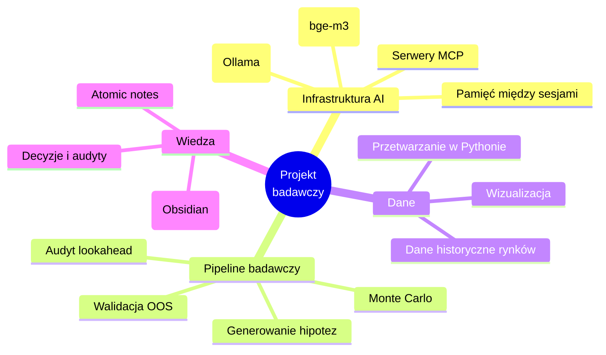

# 🔭 O projekcie badawczym

> Sanityzowany przegląd. Kod i konkretne strategie pozostają prywatne — poniżej opisuję
> **skalę, strukturę i sposób pracy**, nie szczegóły edge'y.

---

## Czym jest

Autorski, długoterminowy projekt badawczy do analizy **rynków finansowych**. Pełnię w nim rolę
„architekta i operatora" sterującego narzędziami AI: od pomysłu, przez implementację, po
weryfikację i raport. Całość prowadzę jako połączoną bazę wiedzy (Obsidian) — zob. graf w README.

---

## Z czego się składa

---

## Czego się nauczyłem (transferowalne)

- **Dyscyplina weryfikacji** — najpierw szukam błędu, dopiero potem ogłaszam wynik.
  To samo podejście stosuję do każdej pracy z danymi.
- **Automatyzacja powtarzalnego** — zamieniam ręczne, nudne kroki w pipeline'y i narzędzia.
- **Praca z modelami AI jako narzędziem inżynierskim** — nie „magia", tylko komponent
  z mocnymi i słabymi stronami, które trzeba znać i kontrolować.
- **Zarządzanie własną infrastrukturą** — stawianie, konfiguracja i utrzymanie lokalnego stacku.

---

## Co mogę pokazać na rozmowie

- Strukturę i historię decyzji projektu (graf wiedzy, dzienniki).
- Sposób, w jaki audytuję wyniki pod kątem typowych błędów analizy danych.
- Konkretne komponenty infrastruktury AI (lokalne modele, RAG, automatyzacja).

> Sam kod strategii i wyniki liczbowe pozostają prywatne — to autorskie badania.

---

🔙 [Powrót do README](../README.md)
