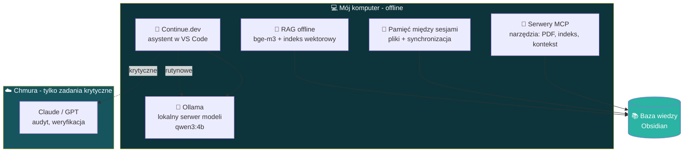

# 🧠 Architektura lokalnego stacku AI

> Jak zbudowałem własną infrastrukturę AI działającą **lokalnie / offline**, żeby ograniczyć
> zależność od płatnych API i pracować na własnym sprzęcie.

---

## Schemat

---

## Komponenty

### 🦙 Lokalne modele LLM (Ollama)
- Stawianie i zarządzanie modelami uruchamianymi **lokalnie** (m.in. `qwen3:4b`) — pełny offline.
- Realne zarządzanie ograniczeniami sprzętu: dobór rozmiaru modelu pod **GPU 4 GB VRAM**, throughput.
- Integracja z edytorem przez **Continue.dev** w VS Code jako asystent kodowania.

### 🔎 RAG offline (wyszukiwanie semantyczne)
- Zbudowany **od zera**: embeddingi `bge-m3` + własny indeks wektorowy.
- Pipeline ingest → search nad bazą wiedzy; pilotaż na realnym korpusie (~1300 fragmentów).
- Pozwala „rozmawiać" z własnymi notatkami bez wysyłania ich do chmury.

### 🔌 MCP (Model Context Protocol)
- Serwery narzędziowe rozszerzające możliwości asystentów AI (np. token-efficient czytanie PDF,
  indeksowanie dużych outputów zamiast ładowania ich w całości).

### 💾 Pamięć między sesjami
- Własny system, dzięki któremu narzędzie AI „pamięta" wnioski z poprzedniej pracy
  (pliki + synchronizacja do bazy wiedzy) — kolejna sesja czyta wniosek, zamiast mielić kontekst od zera.

### ⚖️ Podział pracy lokalne vs chmura
- **Rutynowe / lekkie** zadania → model lokalny (za darmo, prywatnie).
- **Krytyczne** (audyt, weryfikacja, gdzie błąd jest kosztowny) → model chmurowy premium.

---

## Dlaczego lokalnie

| Korzyść | Znaczenie |
|---|---|
| **Prywatność** | Dane i notatki nie opuszczają komputera |
| **Koszt** | Brak opłat za API przy rutynowej pracy |
| **Kontrola** | Pełne panowanie nad modelem, wersją, zachowaniem |
| **Nauka** | Realne zrozumienie, jak działają modele i ich ograniczenia |

---

🔙 [Powrót do README](../README.md) · ⚙️ [Pipeline badawczy](workflow.md)
