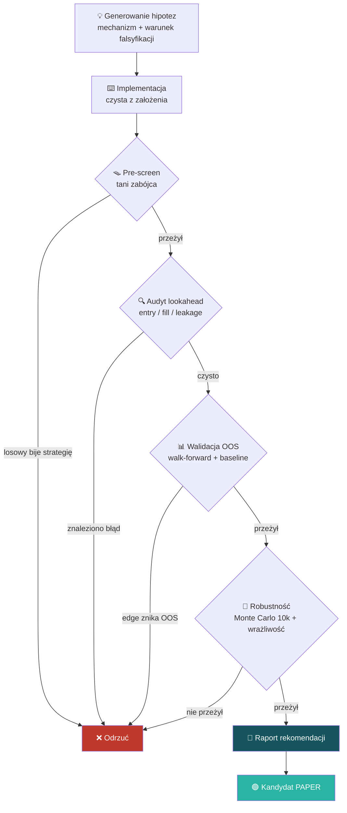

# ⚙️ Jak pracuję — bramkowany pipeline badawczy

> Sanityzowany przegląd metody pracy. Bez szczegółów strategii — chodzi o **proces**, nie o edge.

Moja praca opiera się na jednej zasadzie: **każdy wynik jest podejrzany, dopóki nie udowodnię,
że jest poprawny.** Dlatego zbudowałem dział badań działający jak mini-zespół R&D — z bramkami,
przez które pomysł musi przejść, zanim uznam go za wartościowy. Większość pomysłów ginie po
drodze — i o to chodzi.

---

## Pełny przepływ

---

## Bramki — co sprawdzam na każdym etapie

| # | Etap | Pytanie kontrolne | Po co |
|---|------|-------------------|-------|
| 0 | **Hipoteza** | Czy jest mechanizm ekonomiczny i warunek falsyfikacji? | Bez tego = data mining, auto-odrzut |
| 1 | **Pre-screen** | Czy losowy sygnał bije strategię? | ~80% trupów ginie w sekundach |
| 2 | **Audyt lookahead** | Czy entry/fill/dane nie „podglądają przyszłości"? | Najczęstsze źródło fałszywych wyników |
| 3 | **Walidacja OOS** | Czy edge przeżywa na danych spoza próby? | Test na overfit |
| 4 | **Robustność** | Czy przeżywa Monte Carlo i zmianę parametrów ±20%? | Test na przypadek/kruchość |
| 5 | **Raport** | Jakie są kryteria sukcesu i kill? | Decyzja zapada na zimno, z góry |

---

## Dlaczego to ma znaczenie

- **Lookahead / data leakage** — błąd, w którym model „widzi przyszłość" — potrafi zamienić
  losowy szum w pozornie genialny wynik. Większość amatorskich analiz na tym pada.
  U mnie **audyt tego błędu jest PIERWSZY**, przed ogłoszeniem jakiegokolwiek wyniku.
- **Bramkowanie** oznacza, że nie zakochuję się w pomyśle — pomysł musi *przeżyć* próby zabicia.
- **Pre-rejestracja kryteriów** (sukces/kill z góry) chroni przed naginaniem wyników po fakcie.

> Ta sama dyscyplina przenosi się na każdą pracę z danymi: weryfikuj źródło, szukaj błędu
> zanim ogłosisz sukces, oddzielaj fakt od hipotezy.

---

🔙 [Powrót do README](../README.md) · 🧠 [Architektura stacku AI](ai-stack.md)
